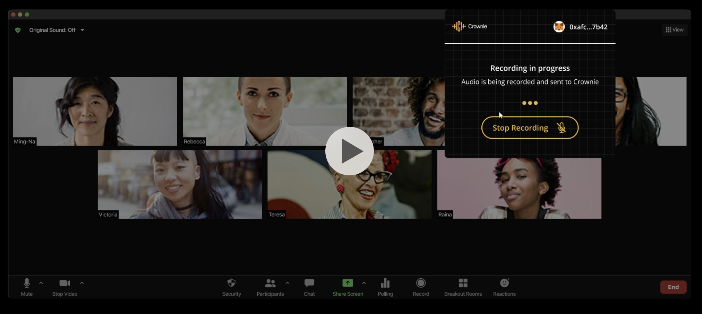

# Crownie 

Crownie is a social consensus layer built into a browser extension that transforms live meetings into secure, coordinated asset swaps using hashlocked escrows and real-time decision making.




**Key Features:**
- **Atomic Swaps**: All-or-nothing guarantees using HTLCs 
- **Social Coordination**: Crownie Extension serves as offchain relayer during live meeting


## Architecture

### Core Components

1. **Escrow Factory Contract**: Deploys and manages HTLC escrows
2. **Resolver Contract**: Orchestrates atomic swaps and manages escrow operations
3. **HTLC Escrows**: Lock assets with hashlock and expiration time guarantees
4. **Crownie Extension**: Offchain live-meeting relayer for secret revelation
5. **Intent-Based Architecture**: Follows 1inch Fusion+ model for efficient swaps

``` 
┌─────────────────────────┐    ┌─────────────────────────┐
│     Etherlink Chain     │    │    Crownie Extension    │
│  ┌─────────────────┐    │    │  ┌─────────────────┐    │
│  │ Escrow Factory  │    │    │  │ Live Meeting    │    │
│  │   Contract      │    │◄───┼──┤   Relayer       │    │
│  └─────────────────┘    │    │  └─────────────────┘    │
│  ┌─────────────────┐    │    │  ┌─────────────────┐    │
│  │   Resolver      │    │    │  │ Secret Monitor  │    │
│  │   Contract      │    │    │  │ & Revelation    │    │
│  └─────────────────┘    │    │  └─────────────────┘    │
│  ┌─────────────────┐    │    │                         │
│  │ Source Escrow   │    │    │                         │
│  │   (HTLC)        │    │    │                         │
│  └─────────────────┘    │    │                         │
│  ┌─────────────────┐    │    │                         │
│  │ Destination     │    │    │                         │
│  │ Escrow (HTLC)   │    │    │                         │
│  └─────────────────┘    │    │                         │
└─────────────────────────┘    └─────────────────────────┘
```


## Testing

1. **Clone & Setup**
```bash
git clone https://github.com/acgodson/crownie-etherlink
cd crownie-swap
pnpm install
```

```bash

cp .env.example .env
# Fill in private Key of Testnet account with XTZ, USDC, USDT. Visit faucet page for Tokens
npm run test
```

**Use cases**
-  Multi-Sig Wallet Approvals
-  Multi-Party Consent for Escrow Swaps
-  Live Streaming Auctions
-  KYC-Free P2P Escrows for Small Teams or Friends
-  DAO treasury management
-  Community-coordinated asset redistribution.


#### Contracts

Resolver Contract: [`0x689b5A63B715a3bA57a900B58c74dA60F98F1370`](https://testnet.explorer.etherlink.com/tx/0xcc682648a0787414b340d5148c3a467b3ae3306670bc7563a7b62b47708575d0)